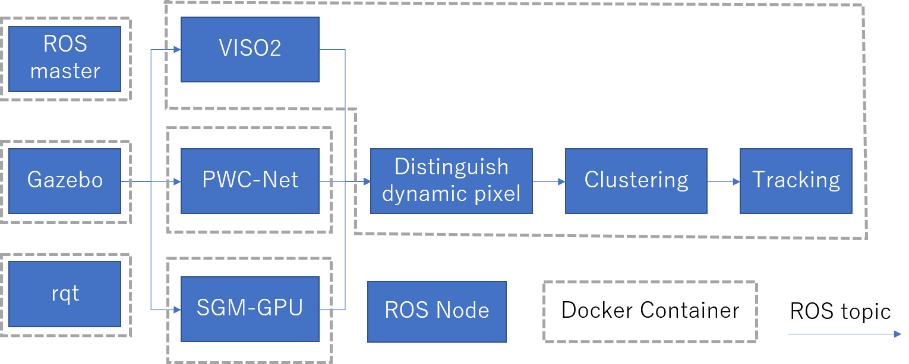

# Moving objects detection from stereo images

This contains ROS packages to detect moving objects from stereo images.

## System overview



## Prerequisite

### Hardware

* NVIDIA GPU
* [Xbox 360 Controller](https://www.microsoft.com/accessories/en-ww/products/gaming/xbox-360-controller-for-windows/52a-00004)

  This can be replaced with other controller supported by [joy package](http://wiki.ros.org/joy).
  But maybe change of key assignment is needed.

### Software

* Docker
* Docker Compose (version >= 1.19)
* [NVIDIA Container Toolkit with nvidia-docker2](https://github.com/NVIDIA/nvidia-docker#nvidia-container-toolkit)

  nvidia-docker2 is deprecated now but it is needed to use Docker Compose with NVIDIA GPU.

## Already tested environment

### Environment 1

#### Hardware

* NVIDIA RTX 2070
* [Xbox 360 Controller](https://www.microsoft.com/accessories/en-ww/products/gaming/xbox-360-controller-for-windows/52a-00004)

#### Software

* Ubuntu 19.04
* Docker 19.03
* Docker Compose 1.21
* nvidia-docker2 2.2.1
* nvidia-container-toolkit 1.0.3

### Environment 2

#### Hardware

* NVIDIA GTX 1060
* [Xbox 360 Controller](https://www.microsoft.com/accessories/en-ww/products/gaming/xbox-360-controller-for-windows/52a-00004)

#### Software

* Ubuntu 18.04
* Docker 19.03
* Docker Compose 1.24
* nvidia-docker2 2.2.1
* nvidia-container-toolkit 1.0.3

## Build

```shell
$ git clone --recursive https://github.com/ActiveIntelligentSystemsLab/moving_object_detector.git
$ cd moving_object_detector/docker
$ sudo docker-compose build
$ sudo docker-compose up --no-start
```

## Test

1. Plug Xbox controller to PC
2. Launch commands at `moving_object_detector/docker` directory:

   ```shell
   $ xhost +local:root
   $ sudo docker-compose start
   ```

   Then Gazebo and rqt windows will be opened. At first start, Gazebo takes some time to download some models.

   Robots in Gazebo is controlled by A + left/right stick.
3. Stop test by:

   ```shell
   $ sudo docker-compose stop
   ```

## Test with Sintel Dataset

You can also use [MPI Sintel Stereo Training Data](http://sintel.is.tue.mpg.de/stereo) as input instead of Gazebo simulator.
But be careful, building docker image for Sintel will take a lot of time to download the dataset.

Launch commands at `moving_object_detector/docker` directory:

```shell
$ xhost +local:root
$ sudo docker-compose -f docker-compose.yml -f docker-compose.sintel.yml
```

## contained packages

* disparity_image_proc

  Small library to process stereo_msgs/DisparityImage

* moving_object_detector_launch

  Launch files

* moving_object_msgs

  Message definition represents moving objects

* moving_object_to_marker

  Convert moving_object_msgs to visualization_msgs/MarkerArray to visualize by RViz

* moving_object_tracker

  Track moving objects by Kalman filter

* project_moving_objects_on_image

  Visualize moving_object_msgs with input image

* scene_flow_constructor

  Construct scene flow from camera transform, disparity image and optical flow

* scene_flow_clusterer

  Clustering scene flow and each clusters are treated as moving objects

* kkl

  Kalman filter library written by Kenji Koide.

* viso2_stereo_server

  Provide service which estimate camera motion from stereo image

