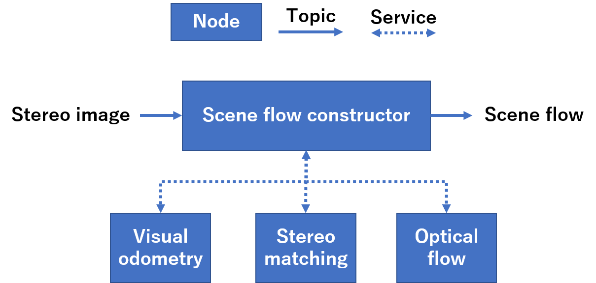
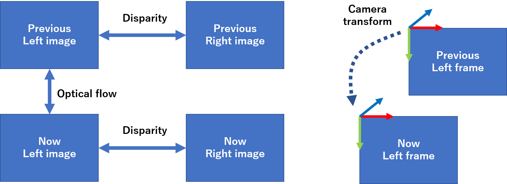

# scene_flow_constructor

A ROS package to construct scene flow from camera transform, optical flow and disparity image.

## Node: scene_flow_constructor_node

Construct scene flow from stereo image.

### Subscribed topics

Input stereo image and camera info.

* `left_image` ([sensor_msgs/Image](http://docs.ros.org/api/sensor_msgs/html/msg/Image.html))

  Should be remapped.

* `right_image` ([sensor_msgs/Image](http://docs.ros.org/api/sensor_msgs/html/msg/Image.html))

  Should be remapped.

* `<base topic of left_image>/camera_info` ([sensor_msgs/CameraInfo](http://docs.ros.org/api/sensor_msgs/html/msg/CameraInfo.html))

  Remapping isn't necessary.

  Automatically find topic name based on `left_image` topic.

* `<base topic of right_image>/camera_info` ([sensor_msgs/CameraInfo](http://docs.ros.org/api/sensor_msgs/html/msg/CameraInfo.html))

  Remapping isn't necessary.

  Automatically find topic name based on `right_image` topic.

### Published topics

* `~optical_flow` ([optical_flow_msgs/DenseOpticalFlow](https://github.com/ActiveIntelligentSystemsLab/ros_optical_flow/blob/master/optical_flow_msgs/msg/DenseOpticalFlow.msg))

  Optical flow of left image, estimated by calling `calculate_dense_optical_flow` service.

* `~disparity` ([stereo_msgs/DisparityImage](http://docs.ros.org/api/stereo_msgs/html/msg/DisparityImage.html))

  Disparity estimated by calling `estimate_disparity` service.

* `~scene_flow` ([sensor_msgs/PointCloud2](http://docs.ros.org/api/sensor_msgs/html/msg/PointCloud2.html))

  Pointcloud with velocity vector in 3D-space.

  It's reference frame is left camera frame when `previous` time.
  
  Type of each point is [PointXYZVelocity](https://github.com/ActiveIntelligentSystemsLab/moving_object_detector/blob/master/scene_flow_constructor/include/scene_flow_constructor/pcl_point_xyz_velocity.h).

* `~synthetic_optical_flow` ([optical_flow_msgs/DenseOpticalFlow](https://github.com/ActiveIntelligentSystemsLab/ros_optical_flow/blob/master/optical_flow_msgs/msg/DenseOpticalFlow.msg))

  Output for debug.

  Synthetic optical flow calculated by camera transform, depth image and static scene assumption.

  Used inside of this node to distinguish dynamic pixels by comparing to `optical_flow`.

* `~optical_flow_residual` ([sensor_msgs/Image](http://docs.ros.org/api/sensor_msgs/html/msg/Image.html))

  Output for debug.

  Residual between `optical_flow` and `~synthetic_optical_flow`.

  Encoding is `mono8` (8bit, single channel, unsigned char).

### Called services

This node obtain optical flow from external service servers.

* `calculate_dense_optical_flow` ([optical_flow_srvs/CalculateDenseOpticalFlow](https://github.com/ActiveIntelligentSystemsLab/ros_optical_flow/blob/master/optical_flow_srvs/srv/CalculateDenseOpticalFlow.srv))

### Parameters

* `~image_transport` (string)

  See [here](http://wiki.ros.org/image_transport#Parameters-1).

Parameters are defined in [here](cfg/SceneFlowConstructor.cfg).

#### Dynamic parameters

List of parameters is [this](cfg/SceneFlowConstructor.cfg).

They can be set by [dynamic_reconfigure](http://wiki.ros.org/dynamic_reconfigure).

## Nodelet: scene_flow_constructor/scene_flow_constructor

Nodelet version.

Topics and parameters are same to the node.

