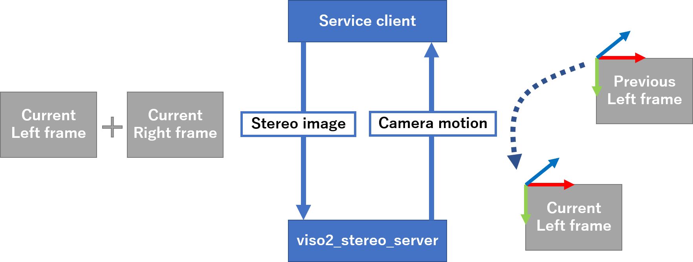

# viso2_stereo_server

A ROS service server to estimate left camera motion from stereo images.

This is forked from [viso2_ros](http://wiki.ros.org/viso2_ros) and depend to [libviso2](http://wiki.ros.org/libviso2) package.

## Nodes

### viso2_stereo_server

A service server to estimate left camera motion from stereo images.

#### Provided service

* `~estimate_motion_from_stereo` ([viso2_stereo_server/EstimateMotionFromStereo](srv/EstimateMotionFromStereo.srv))

  Return left camera motion from previous frame to current frame.

  See [the service definition](srv/EstimateMotionFromStereo.srv) for detail.

#### Parameters

Parameters are almost same to viso2_ros but some of them are deleted.

List of parameters is obtained from [here](include/odometry_params.h) and their role is described at [viso2_ros](http://wiki.ros.org/viso2_ros).

### viso2_service_test_client

Test client node for EstimateMotionFromStereo service.

Subscribe stereo image topic and call EstimateMotionFromStereo service and then print result.

#### Subscribed topics

* `left_image` ([sensor_msgs/Image](http://docs.ros.org/api/sensor_msgs/html/msg/Image.html))

  Used as request of EstimateMotionFromStereo service.

* `right_image` ([sensor_msgs/Image](http://docs.ros.org/api/sensor_msgs/html/msg/Image.html))

  Used as request of EstimateMotionFromStereo service.

* `<base topic of left_image>/camera_info` ([sensor_msgs/CameraInfo](http://docs.ros.org/api/sensor_msgs/html/msg/CameraInfo.html))

  Used as request of EstimateMotionFromStereo service.

  Manual remapping is not needed. 
  
* `<base topic of right_image>/camera_info` ([sensor_msgs/CameraInfo](http://docs.ros.org/api/sensor_msgs/html/msg/CameraInfo.html))

  Used as request of EstimateMotionFromStereo service.

  Manual remapping is not needed. 

#### Called service

* `estimate_motion_from_stereo` ([viso2_stereo_server/EstimateMotionFromStereo](srv/EstimateMotionFromStereo.srv))

#### Parameters

* `~image_transport` (string, default: "raw")

  See [image_transport](http://wiki.ros.org/image_transport#Parameters-1).

## Launch file

### test_service.launch

Test viso2_stereo_server with viso2_service_test_client and `bag/test.bag`.

